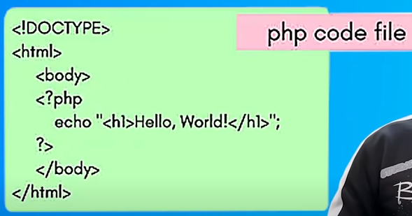
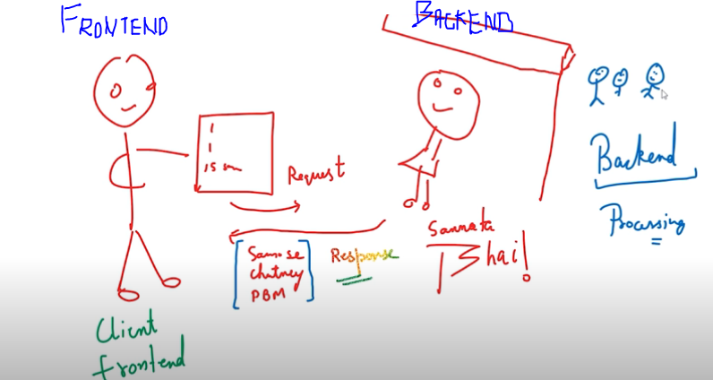

# Php tutorial (personal home page)
**it is genral purpose scripting language which come inhand in web development**
**it made backend development easy.**

1. when client on frontend send request to server > then server do processing on backend.

2. server after doing proceesing it provide client in form of [html, javascript, css].

## Example to understand

1. Client on frontend_browser search "sachin tendulkar" and send request to > web server.

2. web server is using php language > now after getting request php will execute with term "sachin tendulkar".

3. and after executing it prepare it as [html, css, javascript] and send response to client.

*in response there can be login too for javascript but there is logic too in backend php, generally we keep that logic in backend php that we don't want to show to the client.*

## get ready php backend

1. install xxamp software. > it install php enviroment and you get mariaDB + apache + perl.

2. phpmyadmin= helps you manage database.

