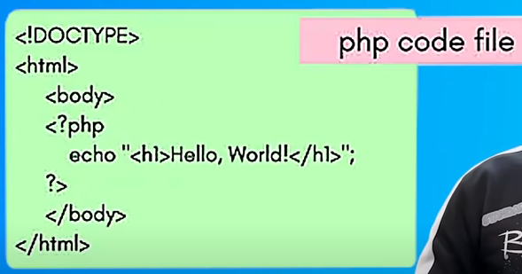
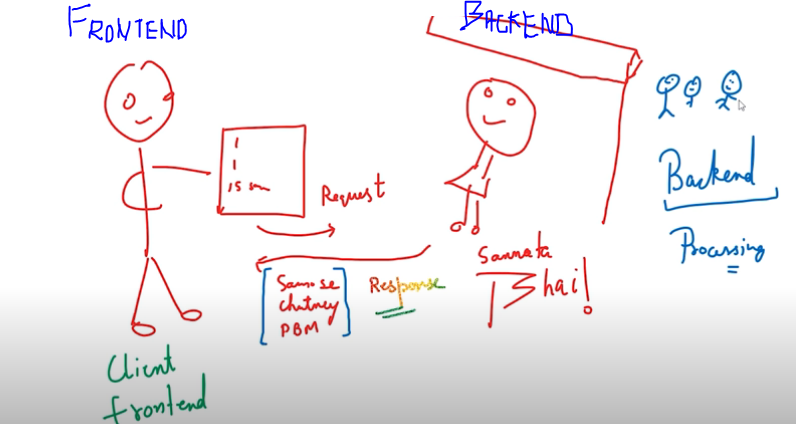

# College Form project in php.
**Follow the steps to learn php.**

## What is PHP (personal home page)
**it is general purpose scripting language which come inhand in web development**
**it made backend development easy.**

1. when client on frontend send request to server > then server do processing on backend.

2. server after doing proceesing it provide client in form of [html, javascript, css].

## Example to understand

1. Client on frontend_browser search "sachin tendulkar" and send request to > web server.

2. web server is using php language > now after getting request php will execute with term "sachin tendulkar".

3. and after executing it prepare it as [html, css, javascript] and send response to client.

*in response there can be login too for javascript but there is logic too in backend php, generally we keep that logic in backend php that we don't want to show to the client.*

## Get ready & run php on backend

1. install xxamp software. > it install php enviroment and you get mariaDB + apache + perl.

2. turn on xamp (apache and mysql) > go to localhost.
on website phpmyadmin= helps you manage database.

3. go to root of xamp_folder > create new file index.php in php-tut_folder.

4. now go to localhost/ to request > it will give response index.php page.
if you write php syntax in index.php then php will first execute and then convert into html and response.

**we are using php here to execute on server as backend language**

5. when you go to page source of respond page it will not show php commands.

**6. Go to Tutorial_folder in this project to learn the basics and come to continue the project.**

## Get ready Mysql

1. After running XAMP, go to "localhost/phpmyadmin" to setup database.

2. On side bar select on new > set the name of database > in that database create new table name.

3. In that table create columns and select acccordingly to that column.

4. after creating columns in table > go to insert tab > which will allow to input data > input the data and press done. (it will provide you predefine command of sql, you will need it ahead in tutorial to insert data into the code. meantioned below.)

**Like mine is**

*INSERT INTO `trip` (`sr no.`, `name`, `age`, `email`, `information`, `dt`) VALUES ('1', 'test name', '18', 'test', 'this is test', '2023-09-14 16:50:23.000000');*

## Create php file on backend.
**Note = xamp will give more priority to the index.php file than index.html**

1. RECOMMENDED = create file of index.HTML & style.CSS in php-tut_folder and this folder "C:\xampp\htdocs"> write code of frontend in it without using php.

2. The code will be there is form and that form is getting information from client and store it into database.

3. Now create index.php > write code & put sql command in php that get execute on backend and than cut & paste the code of index.html into index.php > now delete the file index.html.

4. REMEMBER = After running XAMP, when ever you go to "localhost" on browser it will pick "localhost/dashboard/index.php" by default which is situated in "C:\xampp\htdocs\dashboard" > but if you want to reach to your file than create folder by php-tut_folder in "C:\xampp\htdocs\php-tut" than enter "localhoat/php-tut" it will reach you to the "localhoat/php-tut/index.php" automatically.

5. After combining php + html in index.php > go to website and see the source code > you will not see source code of php because firstly we are not running php and secondly php is generate dynamically.

Thanks.